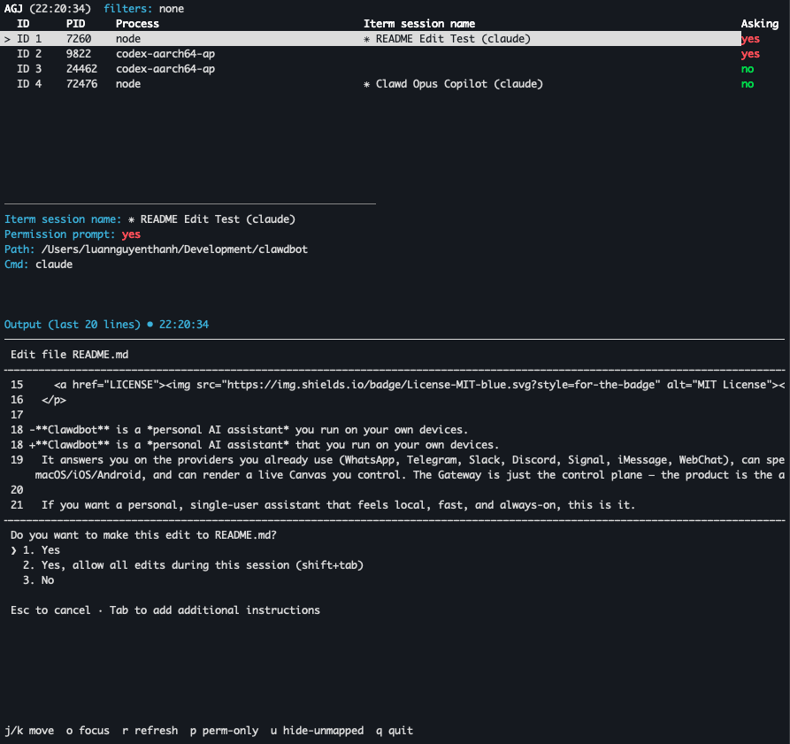

# AGJ

AGJ is a tiny CLI to watch coding agents (Codex / Claude) running in iTerm2, tell you when they’re waiting for permission, and jump to the right pane fast.



## What it does
- Lists active agent sessions in iTerm2
- Shows whether an agent is asking for permission
- Lets you focus a session by ID
- Lets you capture recent output

## Install

Recommended (isolated):
```
pipx install agj
```

Standard pip:
```
pip install agj
```

## Quick start

List active agents:
```
agj list
```

Open the TUI:
```
agj tui
```

Jump to one:
```
agj focus --id 1
```

Only show agents asking for permission:
```
agj list --permission-only
```

Capture recent output:
```
agj capture --id 1 --lines 50
```

## Requirements
- macOS
- iTerm2 running with Python API enabled
- Python 3.11+

## Development
```
uv sync
uv run -- python -m pytest
uv run agj list
```
