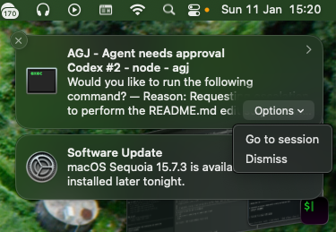

# AGJ

AGJ monitors Codex/Claude sessions in iTerm2 so you never miss a permission prompt while multitasking. It shows which agent is waiting for approval, sends macOS notifications, and lets you go to the right pane fast.




## What it does
- Lists active agent sessions in iTerm2
- Detects Codex/Claude permission prompts and error states
- Shows agent state: permission, error, running, or idle
- Goes to the right pane instantly
- Captures recent output for quick context
- Sends notifications and lets you jump straight to the session that needs approval

## How state is determined
AGJ determines state from the session output in this order:
1) **permission**: a permission prompt is detected
2) **error**: an error signature is detected
3) **running**: output changes between checks
4) **idle**: output does not change between checks

By default AGJ captures the last 60 lines, then re-checks output after short delays
(default `0.3,0.8` seconds). You can tune this with `--idle-checks`.

### Idle detection limitations
Idle is based on **no output change**, not on true task completion. This means:
- A model can be “thinking” and still appear idle if it doesn’t print output.
- Very slow updates might be missed unless you increase `--idle-checks`.
- Short-lived output that appears and disappears between checks can be missed.

## Architecture (TUI)
- Two iTerm2 connections: main (list/focus/output) + scan (permission/error).
- List refresh every 5s; selected output refresh every 3s.
- Output cache per session to keep `o`/detail view responsive.
- Permission/error scan runs after list mapping and fans out in threads.

## iTerm tab titles
AGJ uses the iTerm2 tab title in the TUI and notifications. You can customize this in iTerm2 to make the display more meaningful:
https://iterm2.com/documentation-session-title.html

## Use cases
- You’re juggling multiple agent sessions and miss permission prompts.
- You want a quick status view of all active Codex/Claude instances.
- You need a fast way to go to the pane that’s waiting on you.
- You want a notification when an agent starts waiting for approval.

## Keywords
codex permission prompt, claude permission prompt, monitor multiple codex sessions, track claude windows, iTerm2 agent status, focus iTerm pane by process, AI agent monitor, agent approval notification, macOS notification for codex

## Install

Recommended (isolated):
```
pipx install agj
```

Standard pip:
```
pip install agj
```

## Quick start

List active agents:
```
agj list
```

Only show agents asking for permission:
```
agj list --permission-only
```

Tune idle detection delays (re-check output before marking idle):
```
agj list --idle-checks 0.3,0.8
```

Open the TUI:
```
agj tui
```

Disable notifications if needed:
```
agj tui --no-notify
```

Enable a notification sound:
```
agj tui --notify-sound Glass
```
Use `default` for the system default sound or `none` to disable sound.

TUI idle detection delays:
```
agj tui --idle-checks 0.3,0.8
```

Jump to one:
```
agj focus --id 1
```

Capture recent output:
```
agj capture --id 1 --lines 50
```

## Requirements
- macOS
- iTerm2 running with Python API enabled
- Python 3.11+
- `alerter` installed for notifications (install from GitHub releases):
  `https://github.com/vjeantet/alerter`

## Development
```
uv sync
uv run -- python -m pytest
uv run agj list
```
